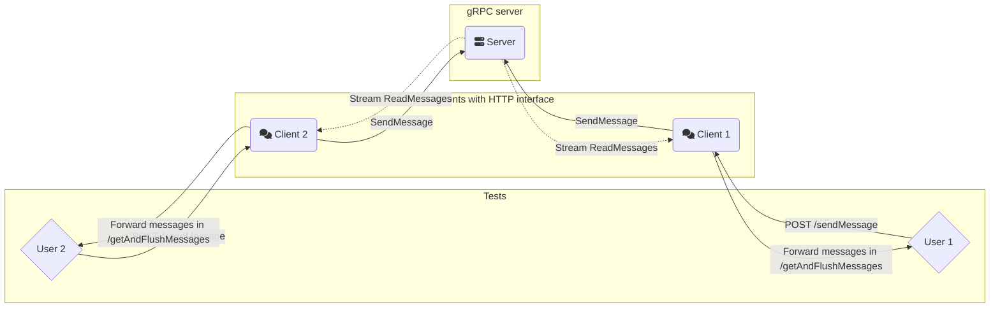
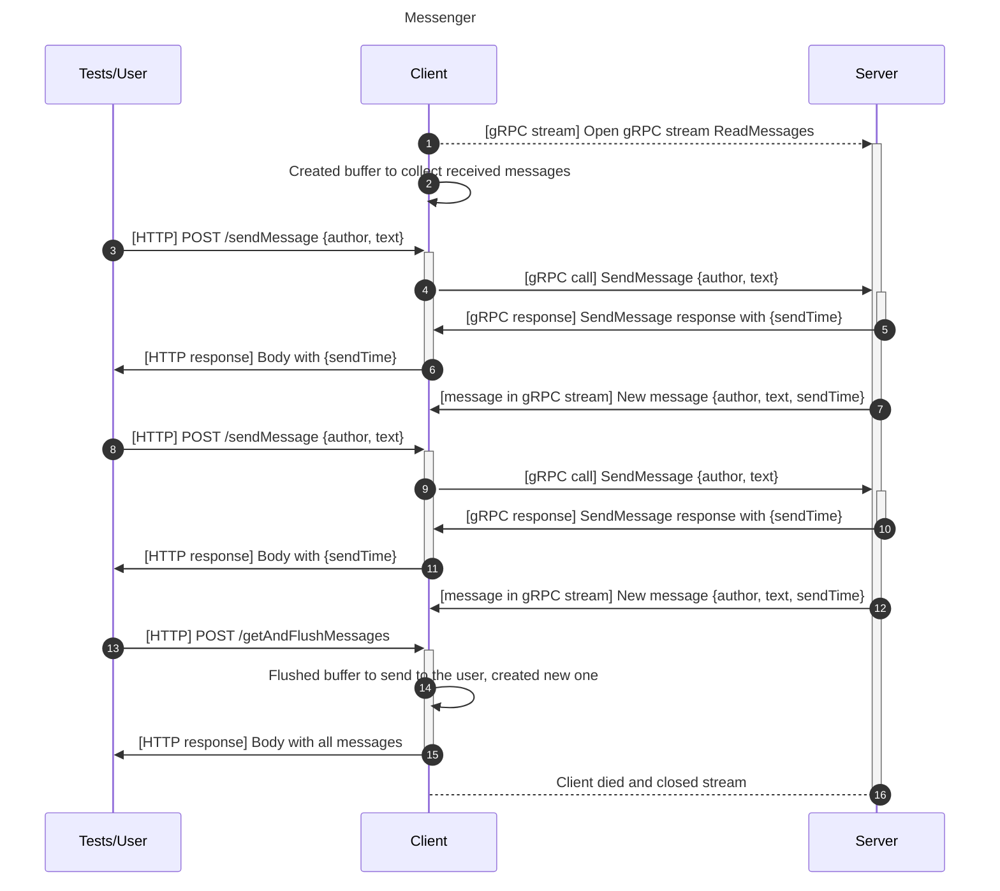

# Мессенджер на gRPC

В этом задании вам предстоит реализовать сервер и клиент для простого мессенджера с одним общим чатом, взаимодействие между которыми будет происходить по gRPC.

У сервера будет два RPC-метода: послать сообщение в чат (SendMessage) и начать принимать поток (stream) сообщений из чата (ReadMessages). Сообщения, которые пришли на сервер до открытия стрима пересылать не надо. Подробные требования к интерфейсу сервера описаны в разделе "Интерфейс взаимодействия с сервером". Сервер должен поддерживать одновременную обработку нескольких запросов.

Клиент, соответственно, должен при включении открыть поток и скапливать в своём буфере пришедшие от сервера сообщения. Каждый клиент должен получать сообщения в том же порядке, в котором они поступили на сервер. Кроме того, через клиент мы должны уметь отправлять сообщения в чат с помощью HTTP интерфейса.

Управление клиентом будет производиться через HTTP. Для этого в заготовках клиентов уже реализован HTTP сервер с двумя методами: `POST /sendMessage` и `POST /getAndFlushMessages`. Их более подробное описание можно найти ниже в документе.

Таким образом, в рамках этого задания вам нужно описать gRPC интерфейс и реализовать две компоненты: gRPC сервер (далее **сервер**), gRPC клиент + HTTP сервер (**клиент**).

Ниже представлена диаграмма коммуникации с одним сервером, двумя клиентами и двумя пользователями (тесты ходят в оба клиента, представляя двух виртуальных пользователей в чате):



## Требования

### Коммуникация между компонентами

На диаграмме ниже представлена последовательность вызовов и ответов между компонентами. Чтобы не усложнять диаграмму, на ней представлен только один клиент, паттерн коммуникации при двух и более не отличается — пришедшие через SendMessage сообщения надо пересылать во все открытие стримы, таким образом клиенты будут получать и свои сообщения, это нормально.



### Интерфейс взаимодействия пользователя с клиентом

Для взаимодействия с пользователем (и для тестов на сервер+клиент) клиент должен реализовывать HTTP сервер, поддерживающий два вида запросов:

```
POST /sendMessage
Отправляет одно сообщение в общий чат.

Тело запроса:
{
    "author": "Ivan Ivanov",
    "text": "Hey guys"
}

Тело ответа:
{
    "sendTime": "..."
}
```
```
POST /getAndFlushMessages
Возвращает буферизированные сообщения, удаляя их из буфера.

Тело запроса: нет

Тело ответа:
[{
    "author": "Ivan Ivanov",
    "text": "Hey guys",
    "sendTime": "..."
},{
    "author": "Petr Petrov",
    "text": "Hey Ivan",
    "sendTime": "..."
}]
```

Примеры вызова HTTP интерфейса клиента с помощью [curl](https://curl.se/):
```
$ curl -X POST localhost:8080/sendMessage -d '{"author": "alice", "text": "hey"}'
{"sendTime":"2025-09-20T10:58:42.665193557Z"}
```
```
$ curl -X POST localhost:8080/getAndFlushMessages
[{"author":"alice","text":"hey","sendTime":"2025-09-20T10:58:42.665193557Z"},{"author":"alice","text":"hey guys","sendTime":"2025-09-20T10:59:46.207409858Z"}]
```

### Интерфейс взаимодействия с сервером

Обратите внимание, что мы тестируем сервер отдельно (чтобы вы могли получить частичные баллы), поэтому необходимо соблюсти наши требования к названиям и содержимому, а именно:
- gRPC сервис должен называться `MessengerServer` и реализовывать два метода: `SendMessage` и `ReadMessages`;
- тело вызова `SendMessage` должно содержать поля `author`, `text`, а ответ должен иметь поле `sendTime`;
- вызов `ReadMessages` не должен содержать полей (можно реализовать Empty сообщение без полей или воспользоваться существующим в библиотеке), а сообщения в стриме должны иметь все три вышеупомянутых поля: `author`, `text`, `sendTime`;
- поле `sendTime` должно иметь тип `google.protobuf.Timestamp`.

Пример вызова gPRC интерфейса сервера с помощью [grpcurl](https://github.com/fullstorydev/grpcurl):

```
# В первом окне терминала:
$ grpcurl -proto messenger/proto/messenger.proto -plaintext localhost:51075 mes_grpc.MessengerServer/ReadMessages
# Устанавливается бесконечное соединение, команда не заканчивается, пока сервер не разорвет соединение или вы не нажмёте CTRL+C в терминале

# Во втором окне терминала:
$ grpcurl -proto messenger/proto/messenger.proto -d '{"author": "alice", "text": "hey"}' -plaintext localhost:51075 mes_grpc.MessengerServer/SendMessage
{
  "sendTime": "2025-09-19T16:56:10.209048300Z"
}

# В первом окне должно появиться сообщение из стрима:
{
  "author": "alice",
  "text": "hey",
  "sendTime": "2025-09-19T16:56:10.209048300Z"
}
```

## Оценивание

Компоненты задания и их вклад в оценку:

- **(2 балла)** Описание gRPC интерфейса сервера в `messenger.proto`.
- **(4 балла)** Реализация сервера (проходят тесты из `test_server.py`).
- **(4 балла)** Реализация клиента (проходят тесты из `test_client.py`).
- Файл `messenger/readme.md` с описанием структуры решения (где какой код лежит), какие именно методы реализованы на сервере и клиенте, как они устроены в паре предложений. Обязательно укажите, какие компоненты были выполнены. При отсутствии описания проверка производиться не будет.

Типичные недостатки и штрафы за них:

- Сервер не поддерживает одновременную обработку нескольких запросов - 2 балла.
- Реализация сервера не является потокобезопасной - 2 балла.
- Клиент может получать сообщения не в том порядке, в котором они поступили на сервер - 2 балла.

## Заготовки для клиента

В папке `templates` предоставлены заготовки для клиента на Python, Python + asyncio и Golang. Только заготовка на Python в `messenger-py/client` является официальной и проверена для текущих условий ДЗ. Остальные заготовки остались с прошлых версий условия и местами могут расходиться с текущим условием. Вы все равно можете их использовать, если поправите расхождения. Вы также можете использовать в решении любой другой язык программирования, так как тестирование происходит через интерфейсы на HTTP и gRPC.

## Порядок выполнения задания

### Структура проекта

Весь код решения должен размещаться в папке `messenger`. Единственное, что нужно соблюсти с точки зрения структуры, это сохранить уже находящиеся здесь файлы:

- `client.dockerfile` - здесь должно быть описание сборки Docker образа клиента (используется в [docker-compose.yml](docker-compose.yml)), вам надо написать его самим ориентируясь на примеры из заготовок.
- `server.dockerfile` - здесь должно быть описание сборки Docker образа сервера (используется в [docker-compose.yml](docker-compose.yml)), его также надо написать самим.
- `proto/messenger.proto` - здесь должно быть описание gRPC интерфейса сервера (используется в тестах, поэтому его содержимое надо только расширять, перемещать файл не следует).

Обратите внимание, что при сдаче решения в тестирующую систему отправляется только папка `messenger`. Поэтому изменения в файлах вне этой папки учитываться не будут.

### Описание и компиляция gRPC интерфейса

Опишите в `messenger/proto/messenger.proto` gRPC интерфейс сервера, содержащий все сообщения и определение сервиса.

Скомпилируйте proto файл с помощью `protoc` в нужный для вас язык. Примеры:

```
# Python
$ python3 -m grpc_tools.protoc -I. --python_out=. --pyi_out=. --grpc_python_out=. messenger/proto/messenger.proto
# Сгенерированные файлы должны оказаться в messenger/proto

# Go
$ cd messenger/proto
$ protoc --go_out=.. --go-grpc_out=.. messenger.proto
# Сгенерированные файлы должны оказаться в messenger/proto
```

### Реализация сервера

Реализуйте сервер, соответствующий сгенерированному интерфейсу. Заготовки для сервера нет. Сервер предлагается реализовать с нуля, используя [gRPC Basics Tutorial](https://grpc.io/docs/languages/python/basics/) и [официальные примеры](https://github.com/grpc/grpc/blob/master/examples) для вашего языка программирования. Тестировать и отлаживать сервер предлагается с помощью утилиты [grpcurl](https://github.com/fullstorydev/grpcurl). Примеры команд есть выше, ниже в бонусной секции про grpcurl и в тестах на сервер.

Сервер на Python рекомендуется расположить в файле `messenger/server/server.py`, так как примеры команд далее будут предполагать, что сервер находится там, и вам будет удобнее их копировать.

В [docker-compose.yml](docker-compose.yml) используются переменные окружения для настройки сервера и клиентов. gRPC сервер должен запускаться по адресу `0.0.0.0:$MESSENGER_SERVER_PORT`, где `MESSENGER_SERVER_PORT` — переменная окружения, по умолчанию равная `51075`.

Метод `ReadMessages` должен быть реализован как **бесконечный** поток сообщений. Клиент вызывает этот метод один раз при запуске, и считывает сообщения из потока по мере их поступления. При поступлении нового сообщения на сервер, сервер рассылает это сообщение всем подключенным клиентам. Каждый клиент должен получать сообщения **в том же порядке**, в котором они поступили на сервер. Если некоторое сообщение было доставлено до момента, когда клиент подключился на прослушивание сообщений через `ReadMessages`, этот клиент не должен получить это сообщение.

Сервер должен быть **многопоточным**, чтобы поддерживать одновременную обработку нескольких gRPC запросов. Примеры реализации многопоточных серверов можно найти в упомянутых туториале и официальных примерах. В качестве альтернативы допускается реализовать **асинхронный** сервер, в котором обработка запросов ведется неблокирующим образом.

### Описание Docker образа для сервера

Напишите `messenger/server.dockerfile` для вашего сервера, чтобы его можно было запустить при тестировании. В качестве образца можно воспользоваться одним из `client.dockerfile` в заготовках клиента.

Единственное требование к образу — нужно, чтобы `CMD` или `ENTRYPOINT` запускали ваш сервер так, чтобы он слушал на порту, указанном в переменной окружения `MESSENGER_SERVER_PORT`.

### Реализация клиента

Реализуйте клиент, который осуществляет вызовы сервера по gRPC и соответствующим образом обрабатывает их результаты. Рекомендуется использовать заготовку в папке `templates/messenger-py/client`. В заготовке уже реализован HTTP сервер для принятия запросов от пользователя. Вам требуется заполнить места, помеченные TODO. 

HTTP сервер в клиенте однопоточный, то есть он обрабатывает не более одного запроса в каждый момент времени. В клиенте также необходимо создать фоновый поток, который будет принимать сообщения от сервера. Взаимодействие между этими потоками должно быть реализовано потокобезопасным образом.

При желании клиент также можно реализовать с нуля на любом языке программирования. В таком случае обязательно используйте переменные окружения:
- `MESSENGER_SERVER_ADDR` — адрес gRPC сервера для подключения клиентов, есть в заготовке;
- `MESSENGER_HTTP_PORT` — порт встроенного в клиента HTTP сервера, есть в заготовке.

### Описание Docker образа для клиента

Напишите `messenger/client.dockerfile` для вашего клиента, чтобы его можно было запустить при тестировании. В качестве образца можно воспользоваться одним из `client.dockerfile` в заготовках клиента.

Опять же, единственное требование — `CMD` или `ENTRYPOINT` должен запускать ваш клиент так, чтобы он слушал на порту `MESSENGER_HTTP_PORT` и открывал gRPC соединение по адресу `MESSENGER_SERVER_ADDR`.

## Тестирование решения

Тесты находятся в папке `tests`. В [test-server.py](tests/test_server.py) содержатся тесты сервера, взаимодействующие с ним по gRPC. В [test-client.py](tests/test_client.py) содержатся тесты клиента, взаимодействующие с ним по HTTP.

### Локальное тестирование

Для тестирования рекомендуется использовать команду `python3 ../cli.py test`. В этом случае используемое окружение будет аналогично тестирующей системе.

Также можно вручную протестировать решение через docker compose следующим образом (фактически это же делается и в тестирующей системе, только внутри контейнера):

```bash
# Соберем все упомянутые в docker-compose.yml образы
docker compose build

# Запустим в фоне сервер и клиентов
docker compose up -d server client1 client2

# Запустим тесты на сервер
docker compose run --rm tests -k test_server

# Запустим все тесты
docker compose run --rm tests

# Если что-то не проходит, можно вывести логи контейнеров
docker compose logs server
docker compose logs client1
docker compose logs client2
docker compose logs # все логи сразу

# Останавливаем все запущенные контейнеры
docker compose down
```

В разделе "Запуск заготовок и тестов" можно прочитать подробнее про различные варианты локального запуска, в том числе без Docker.

### Тестирование в тестирующей системе

Отправьте ваше решение в тестирующую систему следуя [инструкции](../readme.md) и дождитесь результатов. Лог тестирования будет содержать вывод docker compose, тестов (ориентируйтесь на `=== RUN TESTS`) и логи контейнеров.

## Запуск заготовок и тестов

Во избежание вопросов про импорты и структуру папок/файлов, авторское решение на Python имеет следующую структуру:

```
messenger
├── __init__.py
├── client
│   ├── __init__.py
│   ├── client.py
│   └── requirements.txt
├── client.dockerfile
├── proto
│   ├── __init__.py
│   ├── messenger.proto
│   ├── messenger_pb2.py
│   ├── messenger_pb2.pyi
│   └── messenger_pb2_grpc.py
├── server
│   ├── __init__.py
│   ├── requirements.txt
│   └── server.py
└── server.dockerfile
```

Однако мы не предъявляем требований к структуре вашего решения, кроме озвученных выше в "Структура проекта". Главное, что `client.dockerfile` и `server.dockerfile` собирались и запускали ваши клиент и сервер соответственно.

### Запуск без Docker

```
# Из папки задания
python3 -m messenger.server.server
python3 -m messenger.client.client
MESSENGER_HTTP_PORT=8081 python3 -m messenger.client.client

MESSENGER_TEST_SERVER_ADDR=localhost:51075 MESSENGER_TEST_CLIENT1_ADDR=localhost:8080 MESSENGER_TEST_CLIENT2_ADDR=localhost:8081 python3 tests/main.py
```

### Запуск в Docker

Соберите все свои сервисы:
```
docker compose build server client1 client2
```

При изменении одного из них достаточно пересобрать только его:
```
docker compose build server
```

client1 и client2 используют один и тот же образ для запуска, поэтому при изменении клиента можно пересобрать только одного из них:
```
docker compose build client1
```

Запустите сервер и клиентов:
```
docker compose up -d server client1 client2
```

Сборка и запуск тестов:
```
docker compose build tests
docker compose run --rm tests
```

Если что-то не работает, запустите сервер и клиентов без флага `-d`, чтобы видеть все ошибки:
```
docker compose up server client1 client2
```

Также можно вывести логи контейнеров:
```
docker compose logs
```

## Полезные материалы

### grpcurl 101

Установка [grpcurl](https://github.com/fullstorydev/grpcurl):
`sudo tar -xf grpcurl_1.9.3_linux_x86_64.tar.gz -C /usr/local/bin`
`brew install grpcurl`

Выжимка из `grpcurl -help` опций, которые пригодятся в этом ДЗ:
```
grpcurl [flags] [address] [list|describe] [symbol]

list
   If 'list' is indicated, the symbol (if present) should be a fully-qualified
service name. If present, all methods of that service are listed. If not
present, all exposed services are listed, or all services defined in protosets.

-proto value
   The name of a proto source file. ...
-plaintext
   Use plain-text HTTP/2 when connecting to server (no TLS).
-d string
   Data for request contents. If the value is '@' then the request contents are
   read from stdin. ...
-v
   Enable verbose output.
-vv
   Enable very verbose output.
```

Уже собранные команды, которые пригодятся:
```
$ cd messenger

$ grpcurl -proto proto/messenger.proto -plaintext localhost:51075 list
> mes_grpc.MessengerServer

$ grpcurl -proto proto/messenger.proto -plaintext localhost:51075 list mes_grpc.MessengerServer
> mes_grpc.MessengerServer.ReadMessages
> mes_grpc.MessengerServer.SendMessage

$ grpcurl -proto proto/messenger.proto -plaintext localhost:51075 mes_grpc.MessengerServer.ReadMessages
# пустой вывод, пока не будут отправлены какие-либо сообщения
> {
>   "author": "alice",
>   "text": "hello",
>   "sendTime": "2025-09-19T17:00:35.172310200Z"
> }
> {
>   "author": "alice",
>   "text": "hello again",
>   "sendTime": "2025-09-19T17:00:48.810687800Z"
> }
>...  # соединение никогда не закрывается, сообщения продолжают поступать

$ grpcurl -proto proto/messenger.proto -d '{"author": "alice", "text": "hello"}' -plaintext localhost:51075 mes_grpc.MessengerServer.SendMessage
> "sendTime": "2025-09-19T17:00:35.172310200Z"
```

### Многопоточное программирование в Питоне 101

Как только в программе появляется больше одного потока и эти потоки начинают обращаться (неважно, на чтение или запись) к одним и тем же данным (одной и той же переменной), необходимо защищать доступ к этим переменным примитивами синхронизации. Подробности на курсе многопоточного программирования. Самый простой примитив синхронизации — мьютекс, в питоне `threading.Lock`. Поток может захватить мьютекс, записать данные в ячейку, и отпустить мьютекс. Гарантируется, что мьютекс может быть захвачен не более чем одним потоком в каждый момент. Пример:

```
import threading

data = 5
lock = threading.Lock()

# код потока:
lock.acquire()
data = 7
lock.release()

# то же самое, с помощью context manager (синтаксический сахар для строчек выше)
# это предпочтительный вариант
with lock:
   data = 7
```

Клиент имеет два потока (main и фоновый поток, который принимает сообщения от сервера). Единственные данные, которые разделяют эти потоки — это `stub` и объект класса `PostBox`. Можно подсмотреть в документации питоновской библиотеки для gRPC, что `stub` является потокобезопасным, то есть разные потоки могут вызывать любые методы у этого объекта. Класс `PostBox` тоже реализован в потокобезопасном стиле: любые обращения к переменной `self._messages` защищены локом. Поэтому при реализации клиента вам не нужно будет добавлять собственных примитивов синхронизации.

Сервер должен быть многопоточным. Это значит, что обработчики gRPC запросов могут быть вызваны одновременно несколькими клиентами. 

Документация, которая вам точно понадобится:
https://docs.python.org/3/library/threading.html#threading.Thread
https://docs.python.org/3/library/threading.html#threading.Lock

При реализации сервера рекомендуется использовать `queue.SimpleQueue`. Эта очередь потокобезопасна по-умолчанию, то есть, чтобы достать или положить элемент, не нужно захватывать мьютекс — он встроен в очередь. Более того, вызов метода `SimpleQueue.get` блокируется и неактивно ждет до тех пор, пока в очереди не появится новый элемент. Для этого `queue.SimpleQueue` использует внутри себя условные переменные. Cм. https://docs.python.org/3/library/queue.html#simplequeue-objects.

Заметьте, что если вы решите использовать несколько `SimpleQueue` и решите складывать их в один список из разных потоков, вам необходимо защитить сам список мьютексом. Также следует помнить, что для обеспечения потокобезопасности надо использовать мьютекс не только в операциях записи, но и чтения защищаемой структуры данных.

Если вы не хотите использовать `SimpleQueue`, вы также можете использовать активное ожидание или сырые [условные переменные](https://docs.python.org/3/library/threading.html#condition-objects) для своей реализации.

Если у вас возникают проблемы, пишите в чат. Любые вопросы про многопоточность принимаются, так как задание на gRPC, а не на многопоточность.

### tmux 101

Вы можете сделать задание без следующей информации, но с tmux это будет удобнее.

В процессе разработки и тестирования вам понадобится держать как минимум 4 открытых терминала: с сервером, двумя клиентами и окном для отправки сообщений клиентам через curl или запуска автоматических тестов.

`tmux` (от 'terminal multiplexor') это консольная утилита, которая позволяет открыть несколько терминалов внутри одного окна. Это может быть удобнее, чем держать четыре независимых окна.

Другой популярный вид использования `tmux` — это работа на удаленном сервере. Терминалы, созданные в tmux продолжают существовать в фоновом режиме, даже если вы случайно или намеренно отключились от сервера. Вы можете подключиться к серверу заново и перейти к активной сессии `tmux`, чтобы продолжить работу. `tmux` это must-have в ежедневном арсенале программиста, поэтому может быть удобно опробовать работу с ним уже сейчас.

Установка: `sudo apt install tmux`

Полезные команды:
```
tmux - создать новую сессию с виртуальными терминалами
CTRL+B % - поделить окно пополам вертикально
CTRL+B " - поделить окно пополам горизонтально
CTRL+B arrow - навигация между окнами
CTRL+B z[oom] - открыть текущее под-окно на весь экран терминала, или вернуть его обратно
CTRL+B [ - перейти в режим скроллинга
CTRL+B ESC - выйти из режима скроллинга
CTRL+B d[etach] - выйти из tmux обратно в командную строку, при этом все запущенные программы продолжат выполняться в фоновом режиме
```

Типичный флоу для 4 окон:
```
cd 02-grpc-messenger
CTRL+B " - поделили горизонтально пополам
CTRL+B % - поделили верхнее окно вертикально пополам
CTRL+B ↓ - перешли на нижнее окно
CTRL+B % - поделили нижнее окно вертикально пополам

Запустить в каждом из окон сервер, клиент 1, клиент 2, и использовать последнее окно для запуска тестов или curl. В последнем окне не забудьте `cd tests`.

Окно с тестами часто удобно зазумить: CTRL+B z

Чтобы проскроллить вывод от тестов: CTRL+B [, выйти из режима скроллинга: ESC.
```
